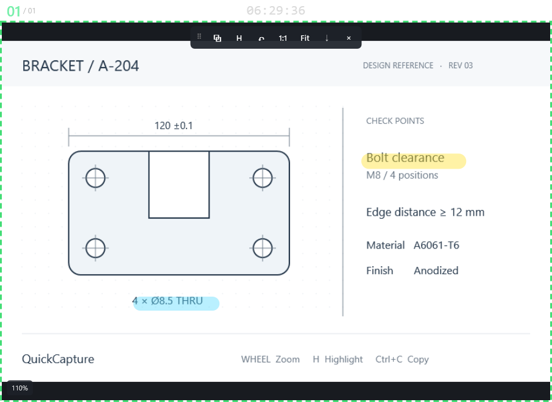
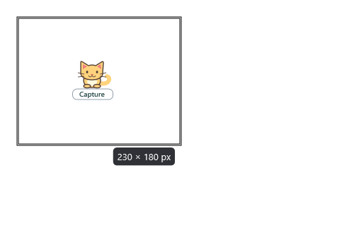
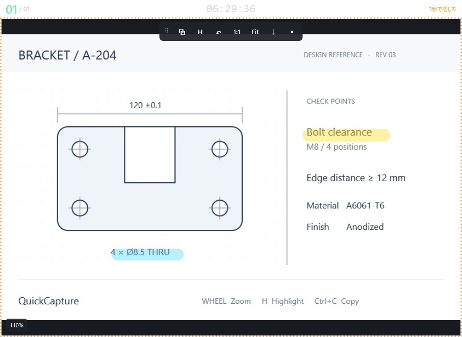
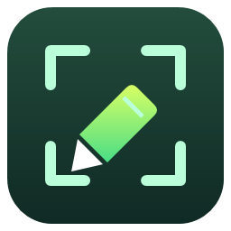

# QuickCapture

Windows 11向けの、画像をデスクトップに置いて参照するキャプチャアプリです。C# / .NET 8 / WPFで実装し、追加のNuGetライブラリは使用していません。Raptureのコードや画像素材は使用していません。

**Ctrl+Shift+R → 範囲をドラッグ → マウスを離す**だけで、画像が独立した最前面ウィンドウになります。保存は必要なときだけ。機械図面やWeb画面を、ホイールで拡大し、Hキーでマーキングし、Ctrl+Cで貼り付けに回せます。



画像はテスト用の架空の図面です。スクリーンショットは実際のWPFコントロールをレンダリングしたもので、上端のツールバーを表示しています。普段は上端にマウスを置いたときだけ表示されます。

## すぐに使う

最新版は **`artifacts/win-x64-v1.7/QuickCapture.exe`** です。旧版が起動中の場合はトレイの「終了」で閉じてから、新版を起動してください（終了すると開いている参照画像も閉じます）。ランタイム同梱なので、利用するPCへの.NETの事前インストールは不要です。Windows 11 x64向けです。

1. 起動すると範囲選択が始まります。ドラッグして離すと画像が表示され、元画像を自動コピーします。そのままCtrl+Vで貼り付けられます。
2. ホイールでカーソル位置を基準にズームし、ウィンドウも連動して拡大・縮小します。左ドラッグでウィンドウを移動、**Alt＋左ドラッグ**でパンします。
3. **Ctrl＋左ドラッグ**でその操作中だけ蛍光ペンを使えます。続けて描くときは**H**で蛍光ペンに切り替えます。マーキング中のパンは**AltまたはSpace＋左ドラッグ**です。
4. マーキング後は**Ctrl+C**で画像とマーキングを再コピーし、貼り付け先でCtrl+Vを押します。
5. **Delete**で画像を閉じます。アプリはトレイに残り、次のCtrl+Shift+Rを待ちます。

通常のウィンドウ移動は**左ドラッグ**です。蛍光ペンON時は左ドラッグで描画するため、移動にはHで解除するか上端ツールバーの左端のつまみを使います。外周をドラッグするとサイズ変更できます。右クリックでも主要な操作を使えます。

キャプチャモードでは画面を暗くせず、**カーソル右下の小さな猫と「Capture」表示**でお知らせします。猫はドラッグ中も追従し、画面端ではモニター内に収めます。範囲の輪郭とピクセルサイズを表示し、猫や輪郭はコピー・保存画像には入りません。



参照画像のウィンドウ枠は明るい緑（#42DD75）の破線、太さ3ピクセルです。枠は物理ピクセルで描くため、表示倍率（125%・150%など）の異なるモニターへ移しても太さ・破線の間隔は変わりません。猫の配置をカーソル右下のすぐ近くへ寄せています。右クリックメニューは先頭と末尾の両方に「閉じる」を用意しています。

画像の破線枠の上に、**大きな番号／表示中の枚数**、**撮影時刻（HH:mm:ss）**、**撮影年月日（yyyy/MM/dd）**を表示します。番号は表示中の画像を撮影順に並べた順番で、閉じる・最小化・再表示に合わせて振り直します。画像を手前へ出しても順番は変わりません。時刻と年月日は撮影時点の値で固定し、この表示部分をドラッグしてウィンドウを移動できます。標準では番号・時刻・年月日はコピーや保存画像に入りません（[記録用に帯ごと残す設定](#上部の帯ごと記録する)もあります）。

右上角にはWindowsと同じ**閉じるボタン（×）**を置いています。ホバーで赤（#E81123）、押している間は明るい赤になり、クリックで画像を閉じます。ボタンの上ではドラッグによるウィンドウ移動は始まりません。押したまま外へ出して離した場合は閉じません。Delete、上端ツールバーの×、右クリックの「閉じる」もこれまでどおり使えます。

時刻は**22ピクセルの文字で中央揃え**です。番号・年月日と同じ1行で上下中央に揃え、上部の帯は34ピクセルに抑えています。帯も枠と同じく物理ピクセルで描くため、画面上の見た目と帯ごと記録した画像が一致し、モニターの表示倍率が変わっても大きさは変わりません。年月日は閉じるボタンの左に右寄せで置きます。狭いウィンドウでは番号や閉じるボタンと重ならないよう、時刻だけ縮小し、必要なら総枚数・年月日・「3秒で閉じる」表示を省略します。

## 連続キャプチャと3秒自動終了

画像またはトレイを右クリックして**「次回以降のキャプチャを3秒で閉じる」**をONにすると、次に撮影する画像から、表示後3秒で自動終了します。画像上の**Tキー**でも同じ設定を切り替えます。操作した画像や既に開いている画像の期限・枠色は変わりません。設定は保存され、OFFに戻すまで連続して適用します。いつものCtrl+Shift+Rやトレイ左クリックで撮影できます。範囲選択が自動で再開する方式ではありません。元画像はこれまでどおり範囲確定直後に自動コピーし、閉じた後も最後にコピーした画像を貼り付けられます。

- **オレンジ（#FFA43E）の点線**：3秒で閉じる画像。
- **緑の破線**：画面に残す画像。
- 一時画像を残したい場合は、その画像を右クリックして**「この画像を残す（自動終了を解除）」**を選びます。この操作はその画像だけに適用し、次回以降の設定は変えません。

残す画像と一時的な画像を混在できます。描画やパンで期限は延長しないため、編集を続けたい一時画像は「この画像を残す」で保持に切り替えてください。PNG保存ダイアログを開いている間だけ自動終了を止め、ダイアログを閉じてから3秒で終了します。



アプリアイコンは、切り抜き枠と蛍光ペンを組み合わせたオリジナルデザインです。exe、タスクバー、トレイで共通のアイコンを使います。



トレイアイコンの左クリックでもキャプチャを開始できます。トレイ右クリックから設定、全画像を閉じる、終了を選べます。ホットキーの競合は通知し、トレイから引き続き操作できます。

範囲選択せず常駐だけ開始する場合:

```powershell
.\artifacts\win-x64-v1.7\QuickCapture.exe --background
```

二重起動は防止します。通常の再起動操作は既存のプロセスにキャプチャ開始を依頼します。`--background`付きの二重起動は何もせず終了します。自動起動登録は行いません。

## ショートカット

| 操作 | キー／マウス |
| --- | --- |
| 範囲キャプチャ | Ctrl+Shift+R（設定変更可） |
| 範囲選択を中止 | Esc |
| カーソル位置を基準に拡大・縮小 | ホイール（通常5〜1600%） |
| パン | Alt＋左ドラッグ／Space＋左ドラッグ（蛍光ペン中も有効） |
| ウィンドウ移動 | 左ドラッグ（蛍光ペンOFF時）／ツールバー左端をドラッグ |
| 100%表示 | Ctrl+0／1（テンキーも対応） |
| ウィンドウにFit | F |
| 100%とFitの切替 | ダブルクリック（蛍光ペンOFF時） |
| 蛍光ペンON/OFF | H |
| 一時的に蛍光ペンを使う | Ctrl＋左ドラッグ（HのON/OFFを変更しません） |
| 線を細く／太くする | `[`／`]`、または蛍光ペン中にCtrl＋ホイール |
| 蛍光ペンの色 | 右クリック → 蛍光ペン → 色 |
| Undo／Redo | Ctrl+Z／Ctrl+Y |
| 描画をすべて消す | Ctrl+Delete／右クリック → 描画をクリア |
| 元画像を自動コピー | 範囲選択を確定した直後 |
| 画像＋描画を再コピー | Ctrl+C |
| 画像＋描画をPNG保存 | Ctrl+S |
| モード解除／描画途中の取り消し | Esc |
| 現在の画像ウィンドウを閉じる | Delete／Alt+F4／上部帯の右上の×ボタン |
| 次回以降のキャプチャの3秒自動終了をON/OFF | T／右クリック → 次回以降のキャプチャを3秒で閉じる |
| 現在の一時画像を保持 | 右クリック → この画像を残す（自動終了を解除） |
| コピー・保存に上部の帯を含める | 右クリック → コピー・保存に上部バーを含める |

100%は**画像1px＝画面の物理1px**です。125%・150%のモニターでも同じ定義です。Fitは必要に応じて通常のホイール下限より小さく表示できます。パンの範囲は制限していません。画像を見失ったらFまたは1で戻せます。

ホイールズームと100%への復帰では画像サイズに合わせてウィンドウを変更します。カーソルが指す画像の位置は画面上で維持し、**画面の下端や右端を越えてもそのまま拡大**します。モニター内に押し戻して画像上側に黒い帯を作る処理は廃止しました。Alt＋左ドラッグでパンでき、1／Ctrl+0で等倍へ戻せます。Fは現在のウィンドウサイズを保って画像をFitさせます。極端なサイズではWin32側の扱いを考慮してウィンドウの一辺を32767物理pxまでに制限します。

蛍光ペンの初期値は緑（#68E675）・20px・不透明度45%。黄色、赤、緑、水色、ピンクを選択できます。線幅は元画像のピクセル単位です。描画中のホイールは無効にして、線の位置が跳ばないようにしています。ドラッグ中断時の未確定線は取り消します。描画クリアもUndoでき、履歴は直近100操作までです。

Ctrl＋左ドラッグは押し始めた時点で蛍光ペンの操作になり、途中でCtrlを離してもマウスを離すまで線を描きます。次の通常の左ドラッグはウィンドウ移動に戻ります（HがONなら描画を継続）。Alt／Spaceを同時に押した場合はパンを優先します。

ほぼ水平・垂直に引いた蛍光ペンは、マウスを離すと開始位置を基準に正確な水平・垂直線へ補正します。目安は軸から10度以内、長さ12元画像px以上です。点列の曲がりや折り返しも確認し、斜線、曲線、往復線、短いマークは補正しません。補正後の線は1操作としてUndo/Redoでき、コピー・保存にも反映します。

コピー・保存は**元画像全体の解像度**で行います。ズーム、パン、ウィンドウの枠、ツールバーは出力しません。現在の表示範囲だけを切り抜く動作ではありません。画像を閉じる際に保存確認は出しません。

白い背景に貼り付けても画像の境界が分かるよう、標準で**薄いグレー（#C8C8C8）・1pxの外枠**を付けます。自動コピー・Ctrl+C・PNG保存すべてが対象です。元画像の端を隠さず外側に追加するため、出力寸法は縦横それぞれ2px増えます（850×420 → 852×422px）。緑／オレンジの操作用ウィンドウ枠は出力しません。

トレイ → **設定… →「コピー・PNG保存画像に薄いグレーの外枠を付ける」**をOFFにすると外せます。開いている画像にも次のコピー・保存から反映し、元の寸法で出力します。既にクリップボードに入れた画像や保存済みのファイルは変わりません。

自動コピーでは範囲確定時の元画像をコピーし、参照ウィンドウを残します。「コピー後に閉じる」設定はCtrl+Cなどの手動コピーにだけ適用します。範囲選択をEscで取り消した場合はコピーしません。

### 上部の帯ごと記録する

記録として残したいときは、トレイ → **設定… →「コピー・PNG保存画像に上部の情報バーを含める」**をONにします。画像の上に、画面と同じ**番号／枚数・撮影時刻・撮影年月日**の帯（34px）を付けて出力します。自動コピー・Ctrl+C・PNG保存すべてが対象で、出力の高さは34px増えます（850×420 → 850×454px、外枠と併用すると852×456px）。閉じるボタンは操作用の部品なので出力には入れません。

画像を右クリックして**「コピー・保存に上部バーを含める」**でも切り替えられます。この操作は**その場で反映**し、**開いているすべての画像**と**次回以降のキャプチャ**にも適用したうえで設定ファイルへ保存します。切り替えた直後にその画像を**自動で再コピー**するため、クリップボードの中身も新しい設定に揃います（このときは「コピー後に閉じる」設定でも画像は閉じません）。標準はOFFで、これまでどおり画像だけを出力します。

ONの間は上部の帯の背景を**濃い青（#153E76）**にして、記録付きで出力する状態だとひと目で分かるようにしています。OFFに戻すと通常の黒い帯（#181B20）に戻ります。出力される帯も同じ濃い青です。

## 開発・ビルド

必要環境はWindowsと.NET 8以降のSDKです。この作業環境にはMicrosoft公式SDK 8.0.424を`.tools/dotnet`へ展開済みです。ビルドスクリプトはローカルSDKを優先し、なければPATH上の`dotnet`を使用します。

```powershell
# ビルド
.\scripts\build.ps1

# 起動（ビルド済みexeと配布用exeのうち最も新しいものを使用）
.\scripts\run.ps1

# 起動（exeがスマート アプリ コントロールにブロックされる場合）
.\scripts\run.ps1 -Dotnet

# 通常の自動テスト
.\scripts\build.ps1 -Test

# 実モニター・画面取得・クリップボードを含む統合テスト
.\scripts\build.ps1 -IntegrationTest
```

統合テストは小さなテスト画像ウィンドウとモニター全体のテスト用オーバーレイを短時間表示し、自動で閉じます。クリップボードにはテスト用画像を入れます。通常のテストでもWPFウィンドウを短時間表示します。`docs/screenshot.png`はテストで再生成されます。

標準の.NET CLIも利用できます:

```powershell
dotnet build QuickCapture.sln -c Release
dotnet run --project src/QuickCapture
```

起動時にコード側でPerMonitorV2のDPI認識を設定するため、exe・`dotnet run`・`dotnet QuickCapture.dll`のどれで起動しても表示倍率の扱いは同じです（exeのマニフェストでも同じ設定を宣言しています）。

### exeが「スマート アプリ コントロール」にブロックされる場合

Windows 11のスマート アプリ コントロール（SAC）は、**署名のないexeを発行元が確認できないという理由でブロック**します。自分でビルドしたexeは未署名のため対象になります。次の順で試してください。

1. **OneDriveの外へ移してブロックを解除する**（無料・元に戻せる）。OneDrive同期フォルダのファイルはインターネット由来の印（Mark of the Web）が付くことがあります。`C:\Tools\QuickCapture`のようなローカルフォルダへコピーし、PowerShellで`Unblock-File .\QuickCapture.exe`を実行してから起動します。
2. **共有ホスト経由で起動する**: `.\scripts\run.ps1 -Dotnet`。Microsoft署名済みの`dotnet.exe`がアプリを読み込みます（SACの設定によってはこちらもブロックされることがあります）。
3. **コード署名証明書で署名する**。恒久的な対策ですが、有料の証明書が必要です。
4. **SACをオフにする**: Windowsセキュリティ →「アプリとブラウザーコントロール」→「スマート アプリ コントロール」→ オフ。⚠️ **一度オフにするとWindowsを再インストールするまで再度オンにできません。**

Visual Studioでは`QuickCapture.sln`を開き、`QuickCapture`をスタートアッププロジェクトにします。「.NETデスクトップ開発」ワークロードを使用してください。VS CodeではC#拡張機能でソリューションを開けます。ビルド・テスト・publishのタスクを`.vscode/tasks.json`に用意しています。

## exeの作成

```powershell
.\scripts\build.ps1 -Publish

# 旧exeが起動中なら別フォルダへ作成
.\scripts\build.ps1 -Publish -PublishDirectory artifacts/win-x64-v1.7
```

出力先は`artifacts/win-x64/QuickCapture.exe`。**ランタイムを含む単一exe**です。約154MiBあり、WPF/.NETのランタイムを含むことによるサイズです。初回起動時には.NETがネイティブライブラリをユーザーの一時ディレクトリへ展開します。

この環境での最初の起動は約7.6秒、展開後の3回は約234〜305msでした（入力待機まで）。常駐後は再起動せずホットキーを使う運用を想定しています。

同等のコマンド:

```powershell
dotnet publish src/QuickCapture/QuickCapture.csproj -c Release -r win-x64 --self-contained true -p:PublishSingleFile=true -p:IncludeNativeLibrariesForSelfExtract=true -p:DebugType=None -p:DebugSymbols=false -o artifacts/win-x64
```

配布サイズを優先し、利用PCに.NET 8 Desktop Runtimeを導入する運用なら、次の小さい単一exeも作成できます:

```powershell
dotnet publish src/QuickCapture/QuickCapture.csproj -c Release -r win-x64 --self-contained false -p:PublishSingleFile=true -p:DebugType=None -o artifacts/framework-dependent
```

WPF用にトリミングは有効にしていません。署名・インストーラー・自動更新機能は初期版の対象外です。

## 設定

トレイの「設定…」から変更できます。保存先は`%LOCALAPPDATA%/QuickCapture/settings.json`です。

```json
{
  "GlobalShortcut": "Ctrl+Shift+R",
  "HighlighterColor": "#68E675",
  "HighlighterWidth": 20,
  "HighlighterOpacity": 0.45,
  "AlwaysOnTop": true,
  "CopyIncludesAnnotations": true,
  "CloseAfterCopy": false,
  "AutoCloseCaptures": false,
  "ExportBorderEnabled": true,
  "ExportHeaderEnabled": false
}
```

ショートカットは保存後すぐ反映します。画像・描画・コピーの初期設定は、以降に開く画像ウィンドウに適用します。外枠設定と上部バー設定は、既に開いている画像にも次のコピー・保存から反映します。各画像の右クリックで変更する色や最前面状態は、その画像だけのものです。不透明度の変更は終了中にJSONを編集してください。設定は検証後に一時ファイルから置換し、破損した設定は保持したまま初期値で起動します。

キャプチャ画像を自動でディスク保存することや、アプリからネットワークへ送信することはありません。履歴は現在開いているウィンドウ内だけです。

## 構成

```text
QuickCapture.sln
src/QuickCapture/
  App.xaml / App.xaml.cs          常駐、トレイ、単一起動、各サービスの接続
  app.manifest                   PerMonitorV2 / 通常ユーザー権限
  Assets/QuickCapture.ico         16〜256pxの9サイズを含むアプリアイコン
  Interop/NativeMethods.cs        Win32、GDI、物理モニター座標
  Services/
    CaptureService.cs            画面取得、独立した選択領域の切り出し
    CaptureCoordinator.cs        モニター別オーバーレイと共通選択状態
    CaptureWindowRegistry.cs     表示中の画像の順番・枚数を更新
    AppIcon.cs                   ウィンドウ・トレイ用の埋め込みアイコン読込
    GlobalHotkeyService.cs        RegisterHotKey、解除、競合検出
    ClipboardService.cs           Bitmap/PNG、短時間の再試行
    ImageExportService.cs        元解像度での描画合成、PNG保存
    SettingsService.cs           JSON読書きと復旧
  Models/
    ImageDocument.cs             画像、注釈、描画コマンド
    Annotation.cs                注釈の描画契約、蛍光ペンの曲線
    UndoRedoManager.cs           100操作のUndo/Redo
    PixelGeometry.cs             物理矩形の計算
    AppSettings.cs               設定とホットキー検証
  Controls/
    ZoomController.cs            画像pxとWPF DIPの双方向変換
    ImageViewport.cs             表示、ホイール、パン、描画入力
    HighlighterTool.cs           線幅・色・点列・補間
    StrokeStraightener.cs        確定時の水平・垂直補正
    DrawingLayer.cs              画像境界内の注釈描画
    CaptureToolbar.cs            上端ホバー時だけ表示する操作群
    CaptureCat.cs                キャプチャ中にカーソルへ追従するベクターの猫
    CaptureHeader.cs             番号・撮影時刻・年月日の帯（画面と出力で共用）
    CaptureFrame.cs              明るい緑の破線枠、上部の帯、閉じるボタン
  Windows/
    CaptureOverlayWindow.cs      各モニターの範囲選択UI
    CaptureWindow.cs             画像ウィンドウ、メニュー、キーの配線
    SettingsWindow.cs            最小限の設定画面
tests/QuickCapture.Tests/          依存ライブラリ不要のSTAテスト実行アプリ
scripts/                         ビルド、テスト、publish、起動
docs/                            スクリーンショット、検証記録
```

アイコンは外部ライブラリ不要のWPFベクター描画で生成しています。`powershell.exe -NoProfile -STA -ExecutionPolicy Bypass -File scripts/make-icon.ps1`でICOとプレビューを再生成できます。

将来の矢印・矩形・テキスト等は`IAnnotation`の実装を追加し、`ImageDocument.Add`でUndo/Redoとコピー・保存へ載せられます。ぼかし・モザイク・OCRは元画像の画素アクセスを必要とするため専用サービスを追加する想定です。ウィンドウ・全画面・遅延キャプチャは`CaptureService`と`CaptureCoordinator`側を拡張できます。これらの将来機能自体はまだ実装していません。

## DPI・性能・メモリ

PerMonitorV2のマニフェストに加えて起動時にコードでもPerMonitorV2を設定し（exe以外の起動方法でも同じ挙動にするため）、画面取得・矩形選択・モニター配置・ウィンドウ枠（破線・上部の帯・閉じるボタン）・最小サイズは物理ピクセルで統一しています。表示倍率の異なるモニターへ移動しても枠の太さや帯の高さは変わりません。ウィンドウの外形もWPFのレイアウト寸法（DIP）ではなく画素数で決め、WPF側のWidth／Heightも同じ画素数に合わせています。倍率が変わってもウィンドウは画像にぴったり合ったままで、画像の周囲に黒い余白は出ません。余分な余白が生じた場合はレイアウト後に切り詰めます（ユーザーがドラッグでサイズを変えた場合は尊重します）。モニターごとに別のオーバーレイを置き、同じグローバル選択矩形をそれぞれのWPF表示サイズへ変換します。ズーム・パン・蛍光ペンには共通の変換を使います。表示構成が変更された場合は選択を中止します。

範囲選択の開始時にデスクトップを一度だけ取得するため、選択中の画面は静止します。確定時にはその画像から必要な画素だけを独立した凍結済みBitmapに切り出し、デスクトップ全体の画像参照は解放します。ズーム時のBitmap再生成は行いません。注釈は凍結したベクターで保持し、元画像と合成するのはコピー／保存時だけです。

概算の画素メモリは幅×高さ×4バイト（4K画像で約31.6MiB）。選択開始中は仮想デスクトップ全体と取得用DIBが一時的に共存します。コピー・保存時にも合成画像やPNGエンコードのメモリが一時的に必要です。大きく離して配置されたモニターの間の空白も仮想画面に含まれます。

GDIリソースは`finally`で解放し、ウィンドウ終了時には画像、注釈、履歴、タイマー、イベント参照を切ります。通常操作で強制GCは実行しません。閉じた直後にタスクマネージャーの使用メモリが必ず即座に減るという意味ではありません。

配布exeの画像なし常駐では、この環境でWorking Set約122MiB、Private Memory約75〜76MiBでした。WPF/.NETの常駐コストを含みます。2秒間の待機計測でCPU時間の増加は0msでした。

## 検証結果

全PhaseでReleaseビルドを実行し、最終ビルドは**警告0・エラー0**。v1.7はWindows 11 x64（build 26200）で**22グループの自動・統合テストが成功**しました。詳細と追加の手動確認手順は[検証記録](docs/validation.md)を参照してください。

| 項目 | 確認状況 |
| --- | --- |
| Windows 11、画像ウィンドウの表示・サイズ変更 | 実行済み |
| 100% / 125%、2モニター、負の座標 | 接続中の実モニターで配置・DPI変換・ウィンドウ移動を確認 |
| 150% | 座標計算テスト済み。実モニター確認は未実施 |
| 4K | 3840×2160の模擬画像で切り出し・初期Fit確認。実4Kモニターは未実施 |
| マウス基準ズーム、パン、拡大中の描画位置 | 変換・逆変換の自動テスト済み。CAD作業での操作感評価は未実施 |
| Undo / Redo / 描画クリア | 履歴分岐・100操作上限を含めて確認 |
| コピー・PNG | Windowsクリップボード往復、Bitmap/PNG形式、寸法・合成画素を確認 |
| Outlook / Teams / PowerPoint / Excel / ChatGPTへの貼付 | 各アプリでの操作は未実施 |
| 画像メモリ・GDI | 閉じた12枚の画像がGC回収可能。40回の取得でGDIハンドル増加なし |

850×420pxの切り出し＋ウィンドウ表示＋Dispatcher idleまでの8回計測は初期版で約103〜125ms、v1.1の今回の実行では約128〜149msでした（自動コピーは別途）。**実画面の最終合成表示まで100ms以内を保証する測定ではありません**。CPU/GPU、画面サイズ、同時ウィンドウ数で変動します。

HDR、保護された映像、UACのセキュアデスクトップ、リモートデスクトップ、モニター間をまたぐドラッグの手動確認は残っています。

実装時の参照: [Microsoftの高DPIガイド](https://learn.microsoft.com/en-us/windows/win32/hidpi/high-dpi-desktop-application-development-on-windows)、[.NET SDKダウンロード](https://dotnet.microsoft.com/en-us/download/dotnet/8.0)。
